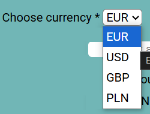
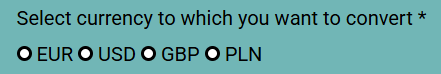
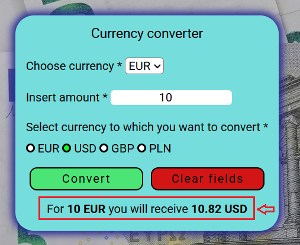

# Currency converter

## Description
This is a simple web application that allows user to convert currencies from one type to another

## Features
- Possibility to convert multiple currencies (EUR, USD, GBP, PLN) - exchange rates are fixed as they are not fetched real-time 
- User-friendly interface

## Live demo
[View live demo](patkolino.github.io/CurrencyExchange/)

## Usage
1. From the drop-down menu choose the currency from which you wish to convert 

2. Insert amount you would like to convert 

3. Select to which currency you would like to convert to 

4. Click "Convert" button 

5. Or select "Clear fields" to reset all the input 

6. The results will appear on the bottom of the app 

## Additional information
- Webpage was built using **HTML**, **CSS** and **JavaScript**
- Normalize CSS included (https://cdnjs.com/libraries/normalize) 
- Code written according to BEM standards
- Background image and page icon were added
- All the required fields are marked with * - app prevents conversion in case of empty fields or incorrect value
- Error message included in case conversion **from** and **to** same currency is attempted

